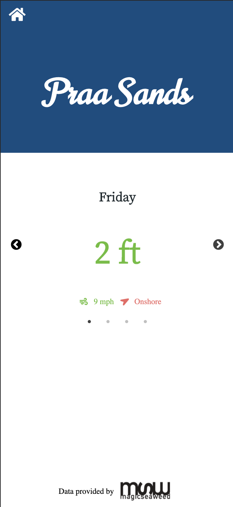
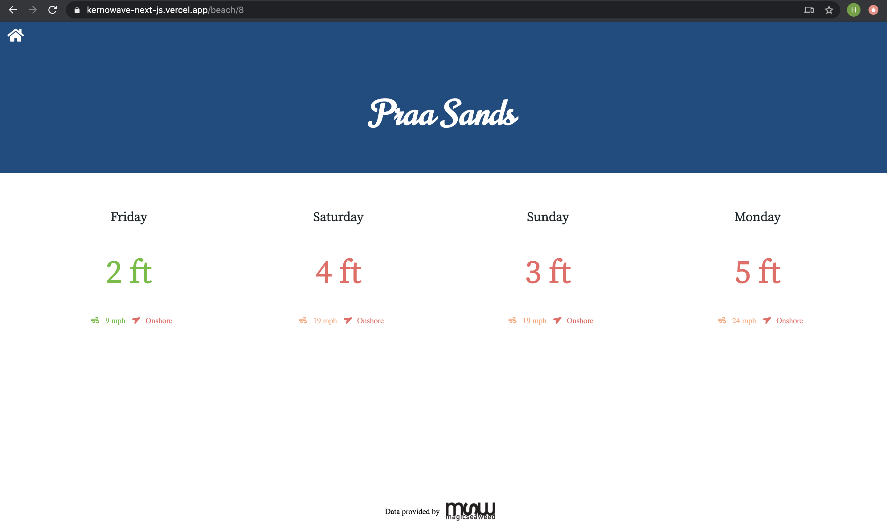

[](https://vercel.com/import/project?template=https://kernowave-next-js.vercel.app/)

# Kernowave

[Description](#description) | [Live Website](#live-website) | [Technologies Used](#technologies-used) | [Challenges and Goals](#challenges-and-goals) | [Getting Started](#getting-started) | [How to Run the App](#how-to-run-the-app) | [Continuous Integration and Delivery](#continuous-integration-and-delivery) | [Next Tasks](#next-tasks)

## Description

A minimalist, sleek and responsive interface for displaying the surf conditions on two beaches in Cornwall. The traffic light colours indicate the surf quality which is calculated from several parameters including wind speed, wind direction, coast orientation and swell height. 

## Live Website

The application is deployed [Here](https://kernowave-next-js.vercel.app/) using Vercel.

|               Phone view               |               Web view               |
| :------------------------------------: | :----------------------------------: |
|  |  |

## Technologies Used

- Main technologies:
  - [Next](https://nextjs.org/): Used for its server-side page pre-rendering, server-side data fetching and client-side route transitions. 
  - [React](https://reactjs.org/): Used for its reusable component based structure, virtual DOM performance enhancements.
  - [Styled components](https://reactjs.org/): For its modular / component css that makes styling react components very easy.

## Challenges and Goals

- [x] Learn about server-side pre-rendering and data fetching with NextJS to enhance rendering performance.
- [x] Use NextJS' smooth page transitions for better user experience.
- [x] Create a responsive app styled with component based css that looks clean, simple on all screen sizes.
- [x] Consume, manipulate and reproduce complex third party API data into a simple user interface.

## Getting Started

In terminal and desired file location:
```
git clone git@github.com:HarryMumford/Kernowave-next-js.git
cd kernowave-next-js
npm i
```

## How to Run the App

- To start dev mode `npm run dev`
- To build `npm run build`
- To start in prod `npm run start`
  
## Continuous Integration and Delivery

Pushing to master will automatically trigger a build and deploy to Vercel

## Next Tasks

- Add more detail on each day of forecast i.e. tide and specific times
- Add an about page explaining how the surf quality is calculated
